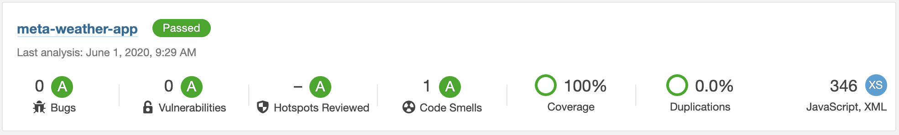

# meta-weather-app

## Requirements

- NodeJS and NPM

## Getting Started

### List of NPM Commands

```terminal
$ npm run start                     # build and start development mode
$ npm run build                     # build a minified production version
$ npm run lint                      # linting using ESLint
$ npm run test                      # run test using Jest
$ npm run test -- --coverage        # run test coverage report
```

## Technical & Libraries In-Use

- MetaWeather (https://www.metaweather.com/api/) for REST API
- Create React App for scaffolding
- Bootstrap for UI components
- Jest & Enzyme for unit testing
- ESLint & SonarQube for code quality and security maintenance
- Redux & Redux-saga for state management / side-effect handling
- Smart and Dumb Components for React development patterns


